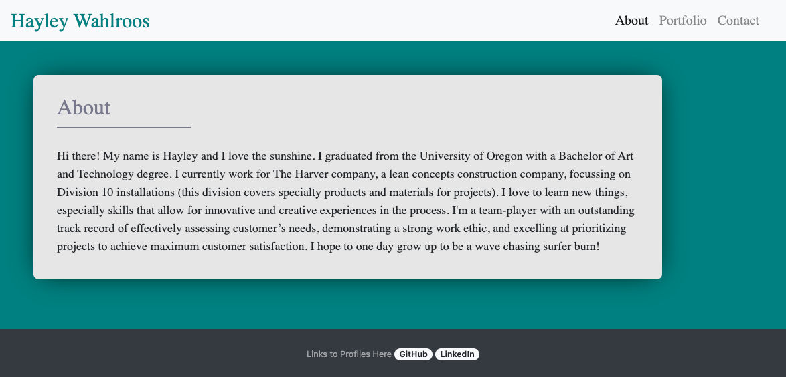

# Responsive Portfolio
A web application highlighting three categories of a portfolio: an about section designed to spotlight personality, acedemic and work career achievements, and lastly a contact form page to get in touch. Top right menu selection is for navigating/relocating to different menu options.

# Summary of changes
* initial commit
* adding navbar
* creating contact form
* linking navbar redirect pages
* adding outline for about section
* testing portfolio thumbnail orientation
* editing semantic flow of css file
* reorganizing navbar code for semantic flow
* editing portfolio thumbnails
* moving script tags to bottom of body
* reorienting dropdown navbar items to right of screen
* editing about section content
* removing commented out/ un-used code
* adjusting style attributes
* reorganizing code for semantic flow
* editing navbar orientation to be uniform on all pages
* adding footer
* adding README.md
* editing footer semantics

# Deployed Portfolio Website Image

# Link to Horiseon Website
https://haywah27.github.io/Wahlroos-Portfolio/